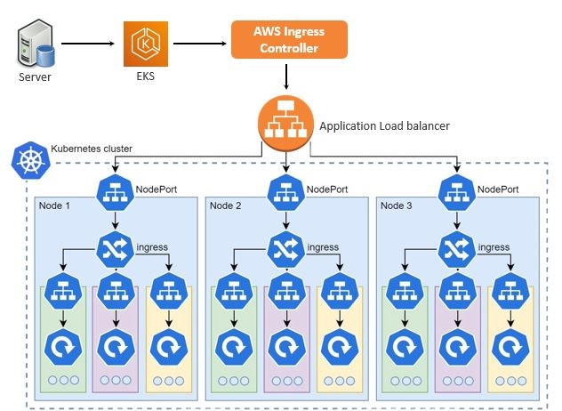

# Project: Game-2048
## Motive

This project will guide you through setting up an AWS EKS cluster powered by Fargate and the AWS Load Balancer Controller, perfect for your applications. You'll also discover the vital roles of ingress resources and ingress controllers, unlocking new levels of scalability and flexibility for your cloud-native deployments!




## Requirements

Before you begin, ensure you have the following tools installed:

- [kubectl](https://kubernetes.io/docs/tasks/tools/install-kubectl-linux/)
- [eksctl](https://eksctl.io/installation/)
- [AWS CLI](https://docs.aws.amazon.com/cli/latest/userguide/getting-started-install.html)
- [Helm](https://helm.sh/docs/intro/install/)

## Getting Started

### Configuration

Configure your AWS CLI with your credentials:
```bash
aws configure
```

Create an EKS Cluster:
- Create your EKS cluster using the following command ~
  ```bash
  eksctl create cluster --name my-demo-cluster --region us-east-1 --fargate
  ```
- Update your kubeconfig to use the newly created cluster ~
  ```bash
  eksctl create cluster --name my-demo-cluster --region us-east-1 --fargate
  ```

Create a Fargate Profile:
```bash
eksctl create fargateprofile \
  --cluster my-demo-cluster \
  --region us-east-1 \
  --name alb-sample-app \
  --namespace game-2048
```

### Deploy the Sample Application

Apply the Game-2048 application configuration:
```bash
kubectl apply -f https://raw.githubusercontent.com/kubernetes-sigs/aws-load-balancer-controller/v2.5.4/docs/examples/2048/2048_full.yaml
```

Check the availability of the pods:
```bash
kubectl get pods -n game-2048
```

### Set Up IAM OIDC Provider

Run the following commands to set up the IAM OIDC provider:
```bash
export cluster_name=my-demo-cluster
oidc_id=$(aws eks describe-cluster --name $cluster_name --query "cluster.identity.oidc.issuer" --output text | cut -d '/' -f 5)
echo $oidc_id

eksctl utils associate-iam-oidc-provider --cluster $cluster_name --approve
```

### Create IAM Policy

Download the IAM policy and create it:
```bash
eksctl create iamserviceaccount \
  --cluster=<your-cluster-name> \
  --namespace=kube-system \
  --name=aws-load-balancer-controller \
  --role-name AmazonEKSLoadBalancerControllerRole \
  --attach-policy-arn=arn:aws:iam::<your-aws-account-id>:policy/AWSLoadBalancerControllerIAMPolicy \
  --approve
```

### Install AWS Load Balancer Controller

Add the Helm repository and install the Load Balancer Controller:
```bash
helm repo add eks https://aws.github.io/eks-charts
helm repo update eks

helm install aws-load-balancer-controller eks/aws-load-balancer-controller -n kube-system \
  --set clusterName=<your-cluster-name> \
  --set serviceAccount.create=false \
  --set serviceAccount.name=aws-load-balancer-controller \
  --set region=<region> \
  --set vpcId=<your-vpc-id>
```

### Check Deployments and Ingress

Verify the installation:
```bash
kubectl get deployment -n kube-system aws-load-balancer-controller
kubectl get ing -n game-2048
```

### Accessing Your Application

After completing the above steps, copy the Load Balancer (LB) address and access your application via your favorite web browser!

### Cluster Cleanup

Once you are done with the project, it is important to delete the EKS cluster to avoid unnecessary charges on your AWS account.
